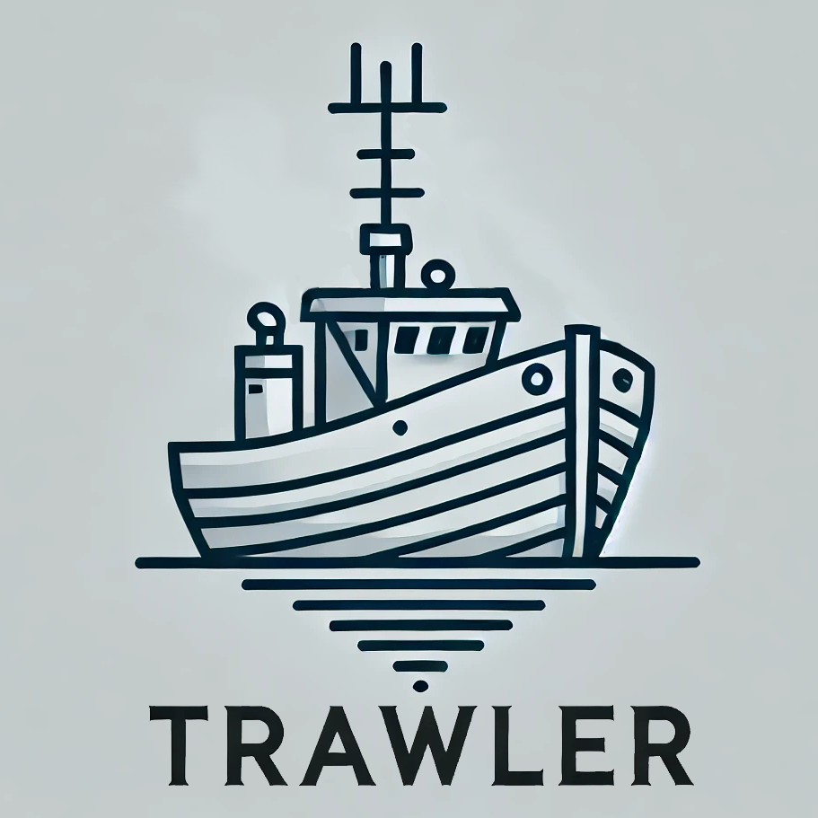

# Trawler

<div style="text-align: center;">
    
</div>

**Trawler** is a tool for inspecting container image layers, similar to `dive`. It allows you to explore the file system of each layer, search and extract files from any layer of a Docker container image.

## Features

- Explore and browse files across all layers of a Docker image
- Extract files and directories from any layer
- Interactive command-line interface
- Search files within a specific layer or across all layers

## Usage

```bash
python3 trawer.py <path_to_container_image.tar/.tar.gz>
```

### Once inside the interface, use the following keys to navigate:

- `↑` / `↓` - Move up and down the list of layers or files
- `Enter` - Open a directory or extract a file
- `e` - Extract a selected file
- `b` / `←` - Go back to the previous directory or layer selection
- `s` - Search for a file within the current layer or across layers
- `q` - Quit the tool

### Installation

1. Clone this repository.
2. Install the necessary Python packages:
   ```bash
   pip install -r requirements.txt
   ```